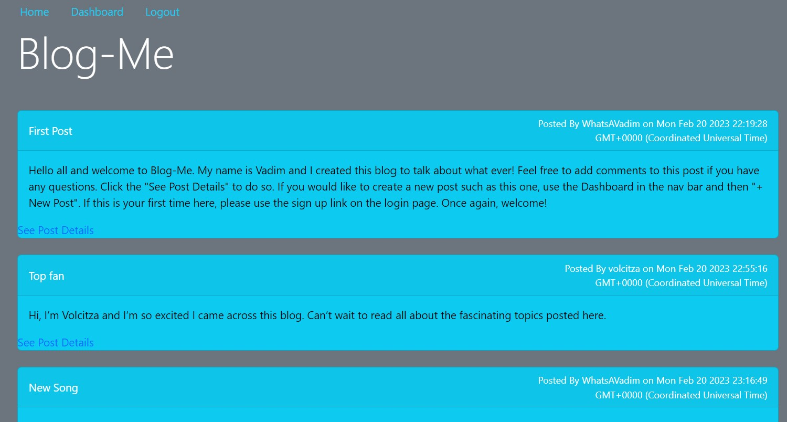

# blog-me

## Description

This project took me around 100 hours/7 days to complete/get to its current state. I wrote around 2300 lines of code using nine dependencies. This was my first solo full-stack application.

- the main motivation for this project was to build a full stack app from start to finish.

- Besides providing coding practice, I can use the blog to post about my technical journey and carry on conversations with friends/family.
- I learned a lot during the development of this application. One of the biggest lessons was CRUD operations using the MVC model. 

## Table of Contents (Optional)
- [Installation](#installation)
- [Usage](#usage)
- [Credits](#credits)
- [License](#license)

## Installation

After cloning repo, please make sure you have nodejs installed then run the following command:
```
npm i
```
After installation add a .env file in the root of the file system and add the following variables with your own credentials:
DB_USER=''
DB_NAME='blog_db'
DB_PASS=''
Make sure you have sql installed. If you do not please follow [sql install guide](https://coding-boot-camp.github.io/full-stack/mysql/mysql-installation-guide)

Once SQL is installed, cd into the db folder, log into sql and run the following command:
```
SOURCE schema.sql
```
```
USE blog_db
```
After quit out of sql, cd back into the project root directory and run the following command:
```
npm run seed
```

## Usage

- Feel free to visit the deployed website:
[blog-me](https://blog-mee.herokuapp.com/)
- Here is the link to the 
[blog-me-repo](https://github.com/Git-Vdim-Hub/blog-me)
- screenshot below



## Credits

This application was built with the use of [nodejs](https://nodejs.dev/en/) and the following npm dependencies: 
[bcrypt](https://www.npmjs.com/package/bcrypt)
[connect-session-sequelize](https://www.npmjs.com/package/connect-session-sequelize),
[express](https://www.npmjs.com/package/express),
[express-handlebars](https://www.npmjs.com/package/express-handlebars),
[express-session](https://www.npmjs.com/package/express-session),
[sequelize](https://www.npmjs.com/package/sequelize?activeTab=readme), 
[dotenv](https://www.npmjs.com/package/dotenv), 
[nodemon](https://www.npmjs.com/package/nodemon), 
[mysql2](https://www.npmjs.com/package/mysql2),

## License: [MIT](https://choosealicense.com/)


## Features

- sign up
- sign in
- log out
- view posts
- add comments to posts
- create new posts
- edit your old posts


